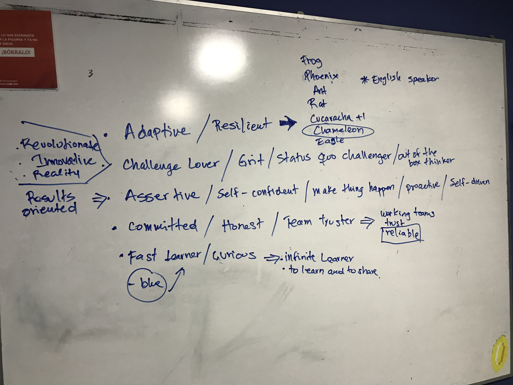

# Tekton-Persona

Estaremos describiendo los valores que deberia de tener toda persona en Tekton
y parte de la cultura de nuestra organizacion.

## Valores de un Tektoniano

Assertive	// Self-Confidence	
Adaptive	// Changes lover (impposible is nothing) //	Resilient
Commited		
Fast Learner // Courious		
Grit		
Honest		
Make things happened practicioner //	Proactive	// Self Driven
Out of the Box thinker		
Team Truster		
Status quo Challenger		

## MANTRA

1) recruting is focus on kill comfort zone
2) try again, fail again, fail better
3) create a jedi-padawan experience
4) throw ego and play with others ideas
5) jedi council example
6) creating products is not about tech is about people

## Culture Code from other companies

https://tettra.co/culture-codes

## Ideas

 - **T**eam player
 - **E**xample
 - loo**K**ing for challenges
 - **T**enacious
 - **O**ut of the box thinker
 - **N**oteworthy

https://thoughtbot.com/playbook

https://www.thoughtworks.com/insights/blog/makings-enduring-organizational-culture

## Finetune

